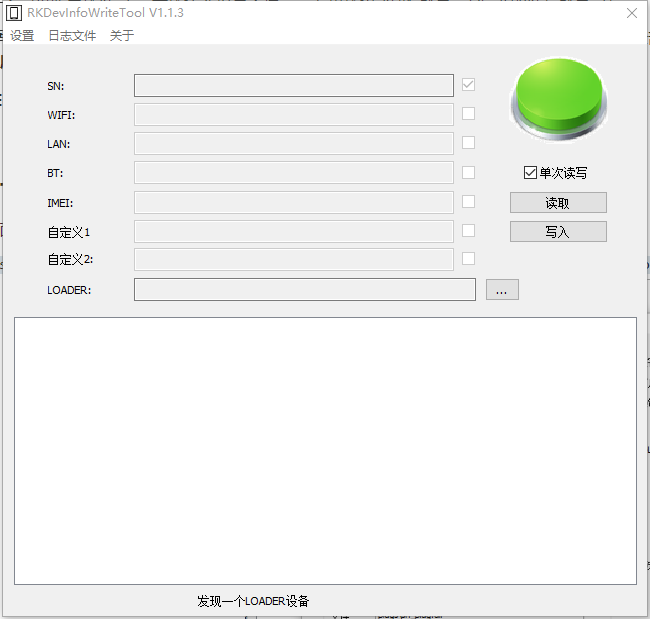
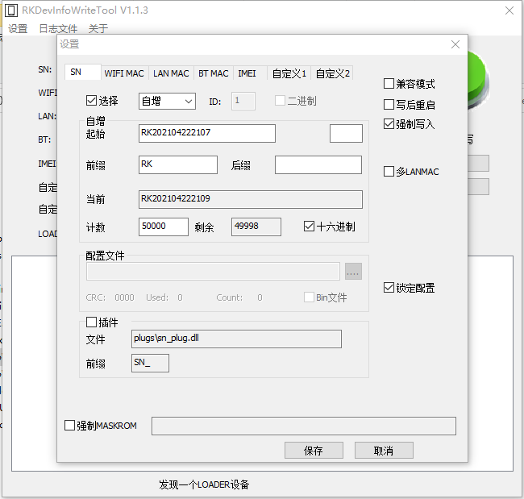
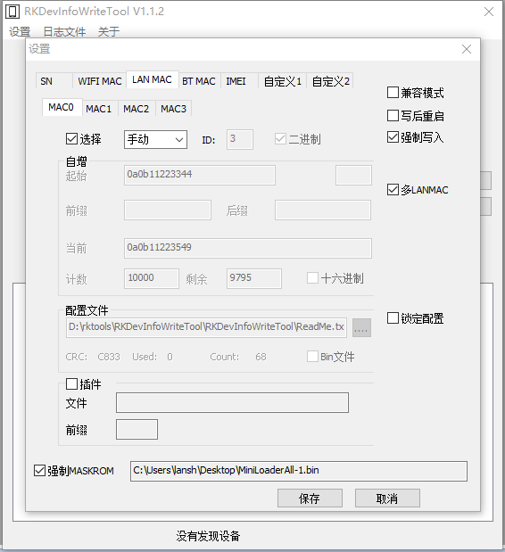

# RKDevInfoWriteTool

RKDevInfoWriteTool is a Rockchip device information writing tool. It writes SN, WIFI MAC, LAN MAC, BT MAC, and other device information to VendorStorage. This section only describes SN and MAC address reading, writing, and continuous auto-increment writing.

<font color=red>**Perform the following operations on a Windows PC. During writing, connect only one target device at a time.**</font>

## Preparation

1. Download the tool: RKDevInfoWriteTool.zip (your_rockchip_sdk_path/tools/windows/RKDevInfoWriteTool.zip).

2. Extract the tool package and keep the directory structure unchanged:

    ```
    RKDevInfoWriteTool-v1.3.7
        ├── RKDevInfoWriteTool.exe
        ├── adb.exe
        ├── RKUpgrade.dll
        ├── config.ini
        ├── Language
        └── plugs
    ```

3. Connect the device to the Windows PC and put the device into Loader or Maskrom mode.

    - Loader mode: use this when the device already has bootable firmware.
    - Maskrom mode: use this for blank devices or devices that cannot enter Loader mode. In this case, select the correct `MiniLoaderAll.bin` in the tool.

4. Double-click `RKDevInfoWriteTool.exe`. After the tool detects the device, the status bar shows that a device has been found.

## Main Interface

The main interface lets you select `SN`, `WIFI`, `LAN`, `BT`, and other write items, and then perform read or write operations:



Common options on the main interface:

| Option | Description |
| --- | --- |
| `Single` | When selected, click `Read` or `Write` manually after each device is connected. |
| Continuous read/write | When `Single` is not selected, connecting a new device automatically triggers the read or write operation. This is useful for batch writing. |
| `Read` | Reads the selected items for verification after writing. |
| `Write` | Writes the configured values of the selected items to the device. |
| `LOADER` | Select the correct MiniLoader file when the device is in Maskrom mode. |

## Writing Configuration

Click `Settings` on the main interface to open the writing configuration dialog:



Common configuration items:

| Item | Description |
| --- | --- |
| `manual` | Enter SN or MAC addresses manually on the main interface. This can also be used with a barcode scanner. |
| `Auto` | Set a start value. After each successful write, the numeric part is incremented by 1. This is useful for continuous writing. |
| `File` | Read SN or MAC addresses from a text file line by line. One line is consumed for each device. |
| `ForceWrite` | When selected, the tool writes even if the device already has the corresponding information. When not selected, existing items may be skipped. |
| `Reboot` | Reboot the device after writing. |
| `compat` | Used for older systems or special cases. For newer systems, leave it unselected first. |

## Write One Device

### Write SN

1. Select `SN` on the main interface.

2. For manual input, open `Settings`, select the `SN` tab, set the value source mode to `manual`, and save the configuration.

3. Enter the serial number in the `SN` input box on the main interface.

    Example:

    ```
    RK2026070801
    ```

4. Click `Write`. After writing succeeds, click `Read` and confirm that the read-back `SN` matches the written value.

### Write MAC Address

The MAC address items on the tool interface are:

| Item | Description |
| --- | --- |
| `WIFI` | WIFI MAC address |
| `LAN` | Ethernet MAC address |
| `BT` | Bluetooth MAC address |

1. Select `WIFI`, `LAN`, or `BT` as needed.

2. Enter the MAC address in the corresponding input box. Use 12 hexadecimal characters without colons or hyphens.

    Example:

    ```
    001A2B3C4D5E
    ```

    If the MAC address is written as `00:1A:2B:3C:4D:5E`, remove the colons before entering it.

3. Click `Write`. After writing succeeds, click `Read` and confirm that the read-back MAC address matches the written value.

## Continuous Auto-Increment Writing

Continuous auto-increment writing is useful for batch production: after each device is written successfully, the tool increments the numeric part of the configured value by 1 and uses the next value for the next device.

### Continuous SN Auto-Increment

1. Open `Settings` and select the `SN` tab.

2. Select `Enable` and set the value source mode to `Auto`.

3. Enter the first SN in `Start`, for example:

    ```
    RK2026070801
    ```

4. If the SN has a fixed prefix or suffix, enter it in `Prefix` or `suffix`. For example, for `RK2026070801`, set `RK` as the prefix so that only the following numeric part increments.

5. Set `Count` to the number of values available for continuous writing.

6. Select `hex` if hexadecimal incrementing is required. Otherwise, decimal incrementing is used by default.

7. Save the configuration and return to the main interface.

8. Clear `Single` on the main interface, connect the first device, and click `Write`. After writing succeeds, disconnect the current device and connect the next one. The tool automatically writes the next SN.

### Continuous MAC Auto-Increment

The LAN MAC configuration interface is shown below. To configure multiple LAN MAC addresses, select `Muti LanMac` and configure the corresponding address in `MAC0`, `MAC1`, `MAC2`, or `MAC3`:



1. Open `Settings` and select the required `WIFI MAC`, `LAN MAC`, or `BT MAC` tab.

2. Select `Enable` and set the value source mode to `Auto`.

3. Enter the first MAC address in `Start`, for example:

    ```
    001A2B3C4D5E
    ```

4. Set `Count`. Select `hex` if hexadecimal incrementing is required.

5. Save the configuration, return to the main interface, and clear `Single`.

6. Click `Write` for the first device. For each newly connected device, the tool automatically writes the incremented MAC address.

## Notes

- SN and MAC addresses must be unique. Do not reuse the same value on multiple devices.
- The PDF states that SN values are expected to follow the GMS rule by default: no more than 14 characters, alphanumeric, and starting with a letter. If the SN does not meet the rule, the device may show a system-generated random SN after reboot.
- A MAC address must contain 12 hexadecimal characters. Valid characters are digits `0-9` and letters `A-F`.
- Before writing, make sure only the items required for this operation are selected to avoid overwriting other device information.
- Before using continuous read/write for batch production, verify writing and read-back on one device first.
- If the tool cannot detect the device, check the USB connection, driver installation, and whether the device is in Loader or Maskrom mode.
